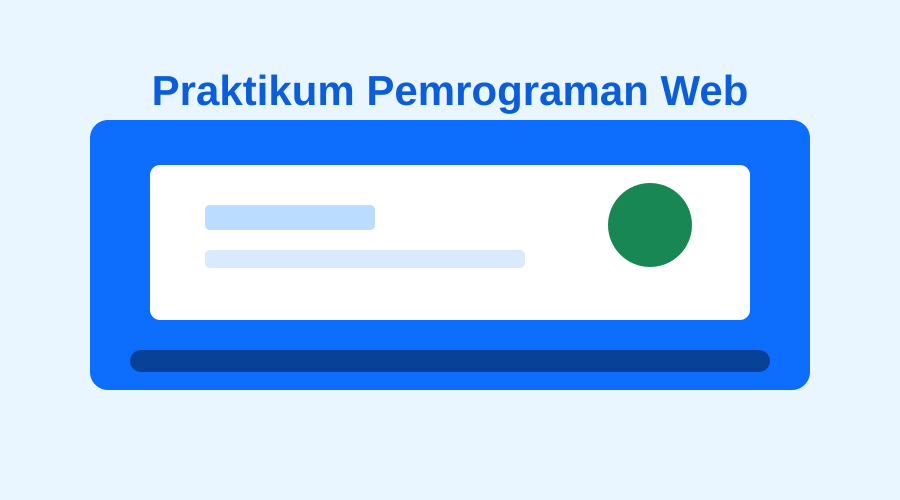
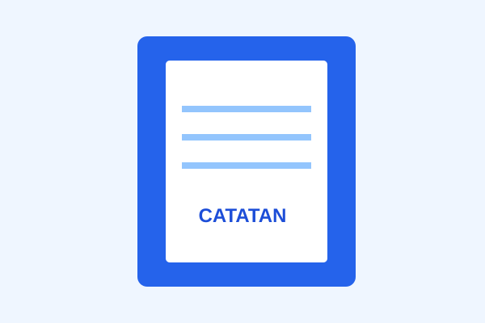

# LAPORAN PRAKTIKUM MODUL 4

## Bootstrap dan Tailwind CSS

**Nama:** Naufal Kafabih Khalwani
**NIM:** 103122400036
**Kelas:** SE-08-02

---

# 1. Tujuan Praktikum

Praktikum Modul 4 bertujuan untuk memahami penggunaan framework CSS **Bootstrap** dan **Tailwind CSS** dalam pembuatan halaman web yang responsif.

Tujuan khusus praktikum ini adalah:

1. Memahami penggunaan Bootstrap 5.3.0 melalui CDN.
2. Menggunakan sistem grid Bootstrap untuk membuat layout responsif.
3. Membuat form menggunakan komponen dan utility class Bootstrap.
4. Membuat tabel menggunakan class Bootstrap.
5. Memahami penggunaan Tailwind CSS melalui Play CDN.
6. Membuat layout responsive menggunakan utility class Tailwind.
7. Menggunakan breakpoint `sm:` dan `lg:` pada Tailwind.
8. Membuat navigasi menggunakan anchor link.
9. Membuat kartu produk menggunakan CSS utility class.
10. Membandingkan pendekatan styling Bootstrap dan Tailwind CSS.

---

# 2. Struktur Folder

Struktur folder yang digunakan dalam praktikum adalah:

```text
Modul04/
│
├── soal_bootstrap.html
├── soal_tailwind.html
│
└── assets/
    ├── kegiatan-kampus.svg
    ├── buku-catatan.svg
    ├── pulpen.svg
    ├── tumbler.svg
    └── tas-kuliah.svg
```

File `soal_bootstrap.html` digunakan untuk mengerjakan soal pertama menggunakan Bootstrap.

File `soal_tailwind.html` digunakan untuk mengerjakan soal kedua menggunakan Tailwind CSS.

Folder `assets` digunakan untuk menyimpan gambar yang digunakan pada kedua halaman.

---

# 3. Soal 1 — Bootstrap

## 3.1 Konsep Bootstrap

Bootstrap merupakan framework CSS yang menyediakan berbagai class siap pakai untuk membuat tampilan website dengan lebih cepat.

Pada praktikum ini digunakan Bootstrap versi 5.3.0 melalui CDN.

Kode yang digunakan:

```html
<link rel="stylesheet"
      href="https://cdn.jsdelivr.net/npm/bootstrap@5.3.0/dist/css/bootstrap.min.css">
```

Dengan menggunakan CDN, Bootstrap tidak perlu diunduh secara manual. Browser akan mengambil file CSS Bootstrap dari server CDN ketika halaman dibuka dengan koneksi internet.

---

# 4. Struktur Dasar HTML Bootstrap

Bagian awal file menggunakan struktur HTML5:

```html
<!DOCTYPE html>
<html lang="id">
<head>
    <meta charset="UTF-8">
    <meta name="viewport" content="width=device-width, initial-scale=1.0">
    <title>Pendaftaran Praktikum Pemrograman Web</title>
    
    <link rel="stylesheet"
          href="https://cdn.jsdelivr.net/npm/bootstrap@5.3.0/dist/css/bootstrap.min.css">
</head>
```

### Penjelasan

`<!DOCTYPE html>` digunakan untuk mendeklarasikan bahwa dokumen menggunakan HTML5.

```html
<html lang="id">
```

Menentukan bahasa utama halaman adalah Bahasa Indonesia.

```html
<meta charset="UTF-8">
```

Digunakan agar karakter dan simbol dapat ditampilkan dengan benar.

```html
<meta name="viewport" content="width=device-width, initial-scale=1.0">
```

Digunakan agar halaman dapat menyesuaikan ukuran layar perangkat, terutama smartphone.

---

# 5. Judul Halaman Bootstrap

Judul halaman dibuat menggunakan:

```html
<h1 class="text-center text-uppercase fw-bold mb-4">
    Pendaftaran Praktikum Pemrograman Web
</h1>
```

Class yang digunakan:

| Class            | Fungsi                              |
| ---------------- | ----------------------------------- |
| `text-center`    | Membuat teks rata tengah            |
| `text-uppercase` | Mengubah teks menjadi huruf kapital |
| `fw-bold`        | Membuat teks menjadi tebal          |
| `mb-4`           | Memberikan margin bawah             |

Dengan kombinasi tersebut, judul memenuhi ketentuan soal.

---

# 6. Container dan Grid Bootstrap

Layout utama menggunakan:

```html
<main class="container py-5">
```

`container` digunakan untuk memberikan batas lebar konten agar halaman terlihat lebih rapi.

`py-5` memberikan padding pada bagian atas dan bawah.

Kemudian digunakan grid:

```html
<div class="row g-4">
```

`row` digunakan sebagai baris Bootstrap Grid.

`g-4` memberikan jarak antar kolom.

---

# 7. Layout Responsif Bootstrap

Informasi praktikum dan form menggunakan:

```html
<section class="col-md-6">
```

Class `col-md-6` memiliki arti bahwa pada ukuran layar medium atau lebih besar, elemen menggunakan 6 dari 12 kolom Bootstrap.

Karena terdapat dua elemen dengan `col-md-6`, maka keduanya memiliki ukuran yang sama:

```text
Desktop:

┌────────────────────┬────────────────────┐
│ Informasi          │ Form Pendaftaran   │
│ Praktikum          │                    │
│                    │                    │
└────────────────────┴────────────────────┘
```

Pada layar yang lebih kecil dari breakpoint `md`, kolom akan otomatis berada di bawah satu sama lain:

```text
Mobile:

┌──────────────────────────┐
│ Informasi Praktikum      │
│                          │
└──────────────────────────┘
┌──────────────────────────┐
│ Form Pendaftaran         │
│                          │
└──────────────────────────┘
```

Hal ini membuat halaman dapat digunakan pada desktop maupun smartphone.

---

# 8. Gambar Bootstrap

Gambar menggunakan:

```html

```

### Penjelasan

`src` menentukan lokasi gambar.

```html
src="assets/kegiatan-kampus.svg"
```

Berarti gambar berada di dalam folder `assets`.

Class:

```html
img-fluid
```

membuat gambar menjadi responsif dan tidak melebihi lebar container.

```html
rounded
```

memberikan sudut gambar yang membulat.

```html
mb-3
```

memberikan margin bawah.

Atribut:

```html
alt="Ilustrasi kegiatan praktikum di kampus"
```

digunakan untuk memberikan teks alternatif apabila gambar tidak dapat ditampilkan dan juga membantu aksesibilitas.

---

# 9. Form Pendaftaran

Form dibuat menggunakan:

```html
<form action="#" method="post">
```

Di dalam form terdapat empat input:

1. Nama Lengkap
2. NIM
3. Email
4. Kelas

Contoh:

```html
<div class="mb-3">
    <label for="nama" class="form-label">
        Nama Lengkap
    </label>

    <input type="text"
           id="nama"
           name="nama"
           class="form-control"
           placeholder="Masukkan nama lengkap"
           required>
</div>
```

`form-label` digunakan untuk memberikan styling pada label.

`form-control` digunakan untuk memberikan tampilan input Bootstrap.

Atribut:

```html
required
```

membuat input wajib diisi.

---

# 10. Input Email

Input email menggunakan:

```html
<input type="email"
       id="email"
       name="email"
       class="form-control"
       placeholder="nama@email.com"
       required>
```

Penggunaan:

```html
type="email"
```

membuat browser melakukan validasi dasar terhadap format email.

Contohnya, jika pengguna memasukkan:

```text
naufal
```

browser akan menganggap input tersebut bukan format email yang valid.

Sedangkan:

```text
naufal@example.com
```

merupakan format email yang valid.

---

# 11. Tombol Form

Tombol daftar:

```html
<button type="submit" class="btn btn-success">
    Daftar
</button>
```

`btn` merupakan class dasar tombol Bootstrap.

`btn-success` memberikan warna hijau.

Tombol reset:

```html
<button type="reset" class="btn btn-secondary">
    Reset
</button>
```

`btn-secondary` memberikan warna abu-abu.

`type="reset"` membuat seluruh input form kembali kosong ketika tombol ditekan.

---

# 12. Tabel Peserta

Tabel menggunakan:

```html
<table class="table table-striped table-bordered table-hover mb-0">
```

Class yang digunakan:

| Class            | Fungsi                                           |
| ---------------- | ------------------------------------------------ |
| `table`          | Styling dasar tabel                              |
| `table-striped`  | Memberikan warna selang-seling pada baris        |
| `table-bordered` | Memberikan border pada tabel                     |
| `table-hover`    | Memberikan efek ketika cursor diarahkan ke baris |
| `mb-0`           | Menghilangkan margin bawah                       |

Tabel juga dibungkus:

```html
<div class="table-responsive">
```

Tujuannya agar tabel dapat digeser secara horizontal ketika ukuran layar terlalu kecil.

---

# 13. Data Tabel

Data yang ditampilkan adalah:

| No. | Nama Lengkap | NIM          | Kelas    |
| --: | ------------ | ------------ | -------- |
|   1 | Alya Putri   | 101142400101 | IF-45-01 |
|   2 | Bima Pratama | 101142400102 | IF-45-02 |
|   3 | Nabila Zahra | 101142400103 | IF-45-01 |

---

# 14. Soal 2 — Tailwind CSS

## 14.1 Konsep Tailwind CSS

Tailwind CSS merupakan framework CSS yang menggunakan pendekatan **utility-first**.

Berbeda dengan CSS biasa, styling dapat langsung ditulis menggunakan class pada elemen HTML.

Tailwind digunakan melalui Play CDN:

```html
<script src="https://cdn.tailwindcss.com"></script>
```

Dengan demikian, halaman dapat menggunakan utility class Tailwind tanpa perlu melakukan instalasi Tailwind secara lokal.

---

# 15. Struktur Dasar Tailwind

Struktur awal:

```html
<!DOCTYPE html>
<html lang="id">
<head>
    <meta charset="UTF-8">
    <meta name="viewport"
          content="width=device-width, initial-scale=1.0">

    <title>Toko Kampus - Katalog Perlengkapan Kuliah</title>

    <script src="https://cdn.tailwindcss.com"></script>
</head>
```

Struktur ini memenuhi ketentuan HTML5, `lang="id"`, dan viewport.

---

# 16. Bagian Beranda

Bagian beranda dibuat:

```html
<header id="beranda" class="bg-slate-900 text-white">
```

`id="beranda"` digunakan sebagai tujuan anchor link.

Class:

```html
bg-slate-900
```

memberikan warna background gelap.

```html
text-white
```

mengubah warna teks menjadi putih.

Judul:

```html
<h1 class="text-3xl sm:text-4xl font-bold">
    Toko Kampus
</h1>
```

`text-3xl` merupakan ukuran teks default.

`sm:text-4xl` membuat ukuran teks menjadi lebih besar pada breakpoint `sm`.

`font-bold` membuat teks tebal.

---

# 17. Navigasi

Navigasi dibuat menggunakan flexbox:

```html
<nav class="mt-6 flex justify-center gap-6">
```

Class:

| Class            | Fungsi                            |
| ---------------- | --------------------------------- |
| `mt-6`           | Margin atas                       |
| `flex`           | Mengaktifkan Flexbox              |
| `justify-center` | Memusatkan item secara horizontal |
| `gap-6`          | Memberikan jarak antar link       |

Contoh link:

```html
<a href="#produk">
    Produk
</a>
```

Ketika link diklik, browser akan berpindah ke elemen yang memiliki:

```html
id="produk"
```

---

# 18. Responsive Grid Tailwind

Bagian paling penting dari soal kedua adalah responsive grid:

```html
<div class="grid grid-cols-1 sm:grid-cols-2 lg:grid-cols-4 gap-6">
```

Class tersebut menghasilkan tiga kondisi layout.

### Layar kurang dari 640 px

```html
grid-cols-1
```

Menampilkan satu kartu dalam satu baris.

```text
┌───────────────┐
│ Produk 1      │
├───────────────┤
│ Produk 2      │
├───────────────┤
│ Produk 3      │
├───────────────┤
│ Produk 4      │
└───────────────┘
```

### Layar minimal 640 px

```html
sm:grid-cols-2
```

Menampilkan dua kartu per baris.

```text
┌─────────────┬─────────────┐
│ Produk 1    │ Produk 2    │
├─────────────┼─────────────┤
│ Produk 3    │ Produk 4    │
└─────────────┴─────────────┘
```

### Layar minimal 1024 px

```html
lg:grid-cols-4
```

Menampilkan empat kartu dalam satu baris.

```text
┌────────┬────────┬────────┬────────┐
│ Produk │ Produk │ Produk │ Produk │
│   1    │   2    │   3    │   4    │
└────────┴────────┴────────┴────────┘
```

Dengan demikian ketentuan responsive pada soal terpenuhi.

---

# 19. Kartu Produk

Contoh kartu:

```html
<article class="bg-white p-5 rounded-xl shadow-md">
```

Class yang digunakan:

| Class        | Fungsi              |
| ------------ | ------------------- |
| `bg-white`   | Background putih    |
| `p-5`        | Padding             |
| `rounded-xl` | Sudut membulat      |
| `shadow-md`  | Memberikan bayangan |

Gambar produk:

```html

```

`w-full` membuat gambar memenuhi lebar kartu.

`h-48` menentukan tinggi gambar.

`object-cover` membuat gambar memenuhi area tanpa merusak rasio tampilannya.

`rounded-lg` memberikan sudut membulat.

---

# 20. Nama dan Harga Produk

Nama produk menggunakan:

```html
<h3 class="mt-4 text-lg font-bold">
    Buku Catatan
</h3>
```

`font-bold` membuat nama produk menjadi tebal.

Harga:

```html
<p class="mt-1 font-semibold text-blue-600">
    Rp15.000
</p>
```

Harga menggunakan warna biru agar terlihat berbeda dari deskripsi.

---

# 21. Deskripsi Produk

Deskripsi menggunakan:

```html
<p class="mt-2 text-gray-500">
    Buku untuk mencatat materi kuliah.
</p>
```

`text-gray-500` memberikan warna abu-abu sesuai ketentuan soal.

---

# 22. Tombol Lihat Detail

Tombol dibuat menggunakan:

```html
<a href="#detail-buku"
   class="inline-block mt-4 px-4 py-2 rounded-lg
          bg-blue-600 text-white hover:bg-blue-800
          transition-colors">
    Lihat Detail
</a>
```

Class yang digunakan:

| Class               | Fungsi                                                  |
| ------------------- | ------------------------------------------------------- |
| `inline-block`      | Membuat link dapat diberi ukuran/padding seperti tombol |
| `mt-4`              | Margin atas                                             |
| `px-4`              | Padding horizontal                                      |
| `py-2`              | Padding vertikal                                        |
| `rounded-lg`        | Sudut membulat                                          |
| `bg-blue-600`       | Background biru                                         |
| `text-white`        | Teks putih                                              |
| `hover:bg-blue-800` | Background menjadi lebih gelap saat cursor diarahkan    |
| `transition-colors` | Membuat perubahan warna lebih halus                     |

---

# 23. Anchor Link Detail Produk

Setiap tombol diarahkan ke detail yang sesuai.

Contoh:

```html
<a href="#detail-buku">
    Lihat Detail
</a>
```

Kemudian bagian detail memiliki:

```html
<article id="detail-buku">
```

Hubungan tersebut membuat browser berpindah ke bagian detail buku ketika tombol diklik.

Hubungan lainnya:

```text
#detail-buku
#detail-pulpen
#detail-tumbler
#detail-tas
```

Dengan demikian keempat tombol memiliki tujuan masing-masing.

---

# 24. Detail Produk

Bagian detail dibuat menggunakan:

```html
<section class="mt-12">
```

Kemudian setiap produk mempunyai elemen dengan ID masing-masing.

Contoh:

```html
<article id="detail-buku"
         class="bg-white p-6 rounded-xl shadow-md scroll-mt-6">
```

`scroll-mt-6` memberikan jarak ketika browser melakukan perpindahan menggunakan anchor sehingga bagian yang dituju tidak terlalu menempel pada bagian atas viewport.

---

# 25. Bagian Kontak

Bagian kontak:

```html
<section id="kontak"
         class="mt-12 bg-blue-900 text-white p-8 rounded-2xl">
```

Class yang digunakan:

* `mt-12` → margin atas
* `bg-blue-900` → background biru gelap
* `text-white` → teks putih
* `p-8` → padding
* `rounded-2xl` → sudut sangat membulat

Email menggunakan:

```html
<a href="mailto:toko@example.com">
    toko@example.com
</a>
```

Dengan `mailto:`, ketika email diklik, browser dapat membuka aplikasi email pengguna.

---

# 26. Perbandingan Bootstrap dan Tailwind CSS

| Aspek      | Bootstrap                   | Tailwind CSS                      |
| ---------- | --------------------------- | --------------------------------- |
| Pendekatan | Component/utility framework | Utility-first                     |
| Responsive | `col-md-6`                  | `sm:`, `lg:`                      |
| Button     | `btn btn-success`           | `bg-blue-600 text-white`          |
| Form       | `form-control`              | Utility class                     |
| Tabel      | `table table-striped`       | Utility class                     |
| Grid       | `row`, `col-md-*`           | `grid`, `grid-cols-*`             |
| CDN        | Bootstrap CDN               | Tailwind Play CDN                 |
| Styling    | Banyak class siap pakai     | Utility class yang dikombinasikan |

Bootstrap lebih banyak menyediakan komponen dengan style bawaan, sedangkan Tailwind memberikan kontrol yang lebih detail melalui utility class.

---

# 27. Pengujian

Pengujian dilakukan pada tiga ukuran layar sesuai ketentuan praktikum:

## 27.1 Ukuran 390 px

Ukuran 390 px digunakan untuk mensimulasikan tampilan smartphone.

Pada Bootstrap:

* Informasi praktikum berada di atas.
* Form berada di bawah informasi.
* Tabel dapat digulir secara horizontal jika diperlukan.

Pada Tailwind:

* Produk ditampilkan dalam satu kolom.
* Navigasi tetap dapat digunakan.
* Konten menyesuaikan lebar layar.

---

## 27.2 Ukuran 800 px

Ukuran 800 px digunakan untuk menguji tampilan tablet atau layar menengah.

Pada Bootstrap:

* Informasi praktikum dan form berada dalam dua kolom karena sudah melewati breakpoint `md`.

Pada Tailwind:

* Produk ditampilkan menjadi dua kolom karena telah melewati breakpoint `sm`, tetapi belum mencapai breakpoint `lg`.

---

## 27.3 Ukuran 1280 px

Ukuran 1280 px digunakan untuk menguji tampilan desktop.

Pada Bootstrap:

* Informasi dan form tetap berada dalam dua kolom dengan ukuran yang sama.
* Tabel menggunakan area halaman yang tersedia.

Pada Tailwind:

* Empat produk ditampilkan dalam satu baris.
* Layout menggunakan `lg:grid-cols-4`.

---

# 28. Hasil yang Diharapkan

### Bootstrap

Pada halaman Bootstrap, pengguna dapat:

1. Melihat informasi praktikum.
2. Melihat gambar kegiatan.
3. Mengisi nama lengkap.
4. Mengisi NIM.
5. Mengisi email.
6. Mengisi kelas.
7. Melakukan validasi input wajib.
8. Melakukan reset form.
9. Melihat tabel peserta.
10. Menggunakan halaman pada berbagai ukuran layar.

### Tailwind CSS

Pada halaman Tailwind, pengguna dapat:

1. Melihat halaman utama Toko Kampus.
2. Menggunakan navigasi Beranda.
3. Menggunakan navigasi Produk.
4. Menggunakan navigasi Kontak.
5. Melihat empat produk.
6. Melihat harga dan deskripsi produk.
7. Membuka detail setiap produk.
8. Melihat efek hover pada tombol.
9. Menggunakan halaman pada smartphone, tablet, dan desktop.

---

# 29. Kesimpulan

Berdasarkan praktikum Modul 4, Bootstrap dan Tailwind CSS dapat digunakan untuk membuat halaman web yang lebih terstruktur dan responsif.

Bootstrap menyediakan berbagai class siap pakai seperti `container`, `row`, `col-md-6`, `form-control`, `btn`, dan `table`. Dengan class tersebut, proses pembuatan form, tabel, dan layout responsive dapat dilakukan dengan lebih cepat.

Tailwind CSS menggunakan pendekatan utility-first sehingga setiap elemen dapat dikustomisasi secara langsung melalui class seperti `bg-blue-600`, `text-white`, `p-5`, `rounded-xl`, `grid-cols-1`, `sm:grid-cols-2`, dan `lg:grid-cols-4`.

Penggunaan breakpoint pada kedua framework memungkinkan tampilan halaman menyesuaikan ukuran layar. Pada praktikum ini, halaman telah dirancang agar dapat digunakan pada ukuran smartphone 390 px, layar menengah 800 px, dan desktop 1280 px.

Dengan demikian, praktikum ini memberikan pemahaman mengenai penggunaan framework CSS untuk membangun halaman web yang lebih rapi, responsif, dan mudah dikembangkan.
